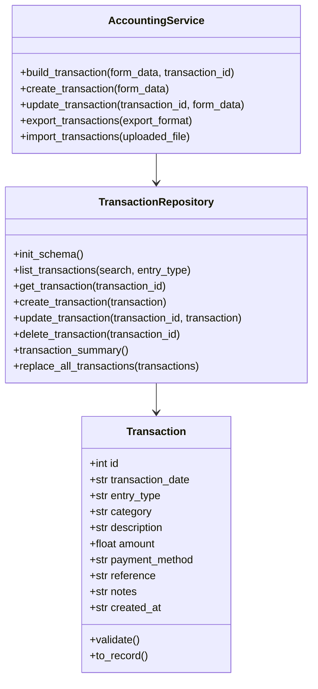

# Technical Report

## 1. Project Title

LedgerLite: Lightweight Accounting Data Management System

## 2. Problem Statement

Manual tracking of daily accounting operations often leads to missing records, duplicated entries, and weak backup practices. This project provides a focused digital solution for recording income and expense transactions with live totals, structured storage, and offline backup files.

## 3. Domain Alignment

This project is aligned with the Economics / Accounting domain because it digitizes a basic bookkeeping workflow used in real accounting contexts.

## 4. Functional Scope

The system supports:

- creating a new accounting transaction
- editing an existing transaction
- deleting a transaction
- filtering transactions by type or keyword
- calculating total income, total expenses, and net balance
- exporting the dataset to CSV, JSON, and TXT
- restoring data from a CSV or JSON backup

## 5. Technical Choices

- Language: Python
- Framework: Flask
- Database: SQLite
- Data files: CSV, JSON, TXT
- Architecture: OOP with repository and service layers

SQLite was selected because the assignment explicitly allows SQL databases and it is the simplest professional option for a lightweight academic mini-project.

## 6. Modules Required by the Assignment

### Part 1. Python Basics

The project uses variables, conditions, loops, functions, and input validation in the service and repository layers.

### Part 2. Files and Data Handling

The system can export accounting records into:

- CSV for spreadsheet compatibility
- JSON for structured backup and portability
- TXT for offline reporting

It can also import CSV and JSON backups.

### Part 3. Database Management

SQLite stores transaction records persistently. The application supports CRUD operations:

- Create
- Read
- Update
- Delete

### Part 4(1). Flask Web Interface

The web application provides:

- a dashboard
- a transaction form
- a backup page

### Part 4(2). OOP Design

The application uses the following classes:

- `Transaction`
- `TransactionRepository`
- `AccountingService`

## 7. UML Class Diagram

## 8. Conclusion

This mini-project demonstrates a full vertical slice from web form input to database persistence and file export. It stays simple enough for an academic submission while remaining professional, coherent, and directly relevant to accounting.
